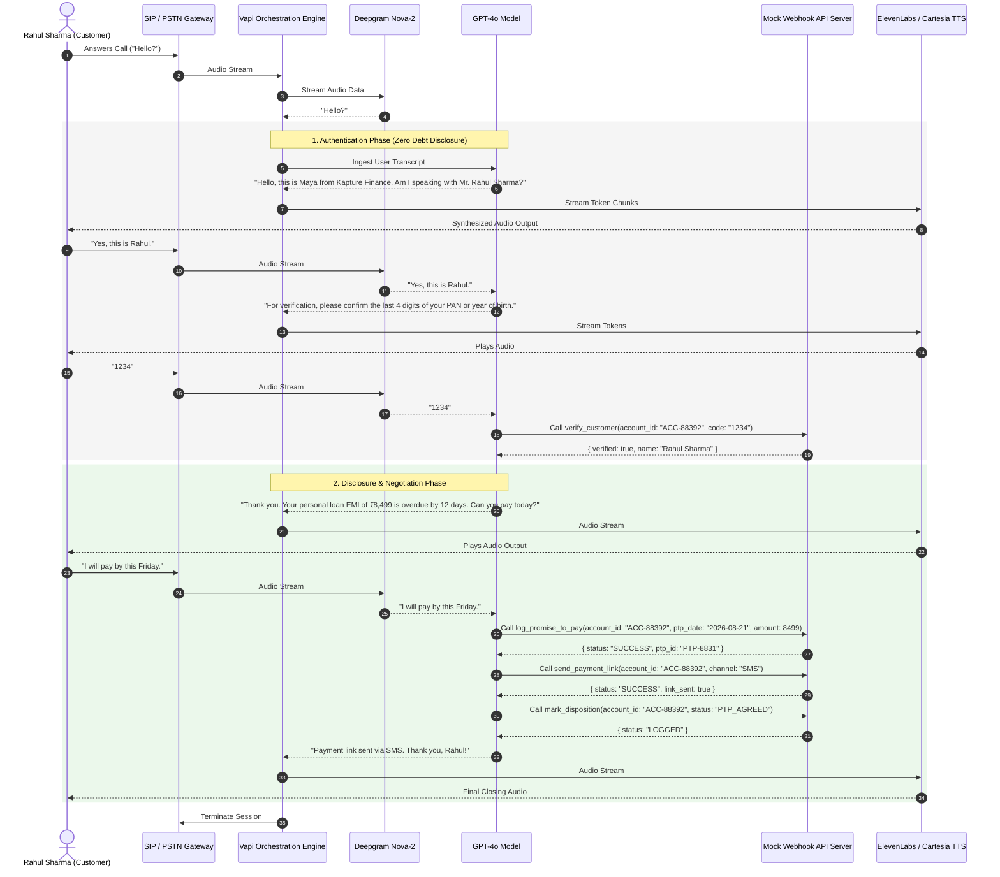

# High-Level Design (HLD): Outbound Voice AI Collections Agent ("Maya")

## 1. System Architecture & Latency Budget
The system implements a low-latency, event-driven voice pipeline orchestrated via Vapi:
- **Telephony Ingress/Egress:** WebRTC / SIP trunks.
- **Speech-to-Text (STT):** Deepgram Nova-2 (Optimized for Indian English & multilingual phoneme extraction; ~200ms).
- **LLM Orchestration:** OpenAI GPT-4o (Temperature 0.1 for strict compliance adherence; ~400ms).
- **Text-to-Speech (TTS):** Cartesia Sonic / ElevenLabs Flash (~250ms).
- **Integration Layer:** Node.js / Express webhook handling verification, CRM state updates, and payment link triggers.

| Pipeline Stage | Provider / Component | Target Latency | Optimization Mechanism |
| :--- | :--- | :--- | :--- |
| **STT Turn Detection** | Deepgram Nova-2 | ~200 ms | Continuous streaming + 300ms endpointing |
| **LLM Inference (TTFT)**| OpenAI GPT-4o | ~400 ms | Token streaming + low-token instruction prompts |
| **Tool Execution** | Mock Express Webhook | ~150 ms | In-memory atomic state evaluations |
| **TTS Synthesis (TTFB)**| Cartesia / ElevenLabs | ~250 ms | Chunked audio streaming over WebSockets |
| **Telephony / Network** | WebRTC / SIP | ~150 ms | Regional edge hosting |
| **Total Round-Trip** | **End-to-End Budget** | **< 1.2 s** | Sub-second human conversational target |

---

## 2. Sequence Flow Diagram (Mermaid)



## 3. Conversation State Machine & Authentication Locking

**STATE_0_GREETING:** Self-identification ("Maya from Kapture Finance") and target verification. No debt terms mentioned

**STATE_1_AUTH_PENDING:** Requests last 4 digits of PAN or Year of Birth.

  Hard Enforcement Lock: Transition out of STATE_1 into STATE_2 is strictly locked until verify_customer returns verified: true.

  If third-party or incorrect details $\rightarrow$ Exit gracefully without debt disclosure.

**STATE_2_NEGOTIATION:** Disclose delinquent amount (₹8,499) and duration (12 days past due).

  Branch A (Promise to Pay): Collect date/amount $\rightarrow$ **STATE_3_PTP_COLLECTED**

  Branch B (Already Paid): Collect payment details $\rightarrow$ **STATE_4_DISPOSITION**

  Branch C (Hardship): Offer partial options or route to $\rightarrow$ **STATE_ESCALATION**

  Branch D (Dispute): Route to $\rightarrow$ **STATE_ESCALATION**

  Branch E (Do Not Call): Log DNC preference $\rightarrow$ **STATE_4_DISPOSITION**

**STATE_3_PTP_COLLECTED:** Trigger log_promise_to_pay and send_payment_link

**STATE_ESCALATION:** Trigger escalate_to_agent with reason context and bridge human rep.

**STATE_4_DISPOSITION:** Log terminal status via mark_disposition and release channel.

## 4. Intent & Entity Taxonomy

| Intent | Utterance Examples | Extracted Entities | Target Tool / Action |
| :--- | :--- | :--- | :--- |
| **`Confirm_Identity`** | "Yes, Rahul here", "Speaking" | `customer_confirmed` (Boolean) | Advance to Auth |
| **`Provide_Verification`** | "PAN last digits are 1234", "1995" | `verification_code` (String) | `verify_customer` |
| **`Promise_To_Pay`** | "I can pay on Friday", "Clearing it tomorrow" | `ptp_date` (ISO-8601), `amount` (Number) | `log_promise_to_pay` |
| **`Already_Paid`** | "I already paid ₹8,499 yesterday via UPI" | `payment_channel` (String), `payment_date` | `mark_disposition(ALREADY_PAID)` |
| **`Hardship_Claim`** | "Lost my job, cannot pay right now" | `hardship_reason` (String) | `escalate_to_agent` |
| **`Dispute_Debt`** | "Not my loan", "Amount is incorrect" | `dispute_reason` (String) | `escalate_to_agent` |
| **`Wrong_Person`** | "Wrong number, Rahul is not available" | `contact_validity` (Boolean) | `mark_disposition(WRONG_PERSON)` |
| **`Request_DNC`** | "Stop calling, put me on DNC" | `opt_out` (Boolean) | `mark_disposition(DO_NOT_CALL)` |

## 5. Tool & API Specifications

```
[
  {
    "name": "verify_customer",
    "description": "Validates customer identity against backend records prior to disclosing debt details.",
    "parameters": {
      "type": "object",
      "properties": {
        "account_id": { "type": "string" },
        "verification_code": { "type": "string" }
      },
      "required": ["account_id", "verification_code"]
    }
  },
  {
    "name": "log_promise_to_pay",
    "description": "Registers an agreed promise-to-pay commitment.",
    "parameters": {
      "type": "object",
      "properties": {
        "account_id": { "type": "string" },
        "ptp_date": { "type": "string", "description": "YYYY-MM-DD format" },
        "amount": { "type": "number" }
      },
      "required": ["account_id", "ptp_date", "amount"]
    }
  },
  {
    "name": "send_payment_link",
    "description": "Dispatches payment link via SMS or WhatsApp.",
    "parameters": {
      "type": "object",
      "properties": {
        "account_id": { "type": "string" },
        "channel": { "type": "string", "enum": ["SMS", "WhatsApp", "BOTH"] }
      },
      "required": ["account_id", "channel"]
    }
  },
  {
    "name": "escalate_to_agent",
    "description": "Transfers call to human collections or grievance desks.",
    "parameters": {
      "type": "object",
      "properties": {
        "account_id": { "type": "string" },
        "reason": { "type": "string", "enum": ["HARDSHIP", "DISPUTE", "AUTH_FAILURE"] },
        "context_notes": { "type": "string" }
      },
      "required": ["account_id", "reason"]
    }
  },
  {
    "name": "mark_disposition",
    "description": "Records call outcome in CRM.",
    "parameters": {
      "type": "object",
      "properties": {
        "account_id": { "type": "string" },
        "status": {
          "type": "string",
          "enum": ["PTP_AGREED", "ALREADY_PAID", "DISPUTED", "HARDSHIP_ESCALATED", "WRONG_PERSON", "DO_NOT_CALL", "NO_INPUT_TERMINATED"]
        },
        "notes": { "type": "string" }
      },
      "required": ["account_id", "status"]
    }
  }
]
```

## 6. Edge Cases & Exception Handling Matrix

| Scenario / Edge Case | Detection Trigger | Agent Behavior & Protocol | Resulting Disposition |
| :--- | :--- | :--- | :--- |
| **Abusive / Hostile Caller** | Profanity / threats detected | Provide 1 polite warning: *"Please remain respectful so I can assist you."* Hang up on repeat offense. | `CUSTOMER_HOSTILE` |
| **Silent User / Voicemail** | No speech detected for 5s | Prompt twice: *"Are you there?"* Terminate if silence persists past 12s total. | `NO_INPUT_TERMINATED` |
| **Language Switch (EN $\leftrightarrow$ HI)** | Hindi/Hinglish phrase input | Switch conversational output to Hindi while maintaining identical state-machine locking and tool execution. | `PTP_AGREED` / Relevant |
| **Failed Auth Attempts** | `verify_customer` returns `false` | Allow up to 2 retry attempts. On 3rd failure, escalate or terminate without revealing account details. | `AUTH_FAILURE` |

## 7. Compliance & Data Safety Protocols

**Zero Third-Party Debt Disclosure:** Absolute ban on discussing loan parameters, EMI figures, or balances before tool-verified authentication.

**Fair Collections Norms:** Calling restricted strictly to 08:00 AM – 07:00 PM local time.

**Data Safety & PII Masking:** All internal logs mask personal data (e.g., Rahul S****, PAN suffix only).

**Anti-Hallucination Guardrails:** System prompts hardcode strict limits preventing the bot from negotiating unauthorized waivers without managerial tool approval.

## 8. Observability & Performance Metrics

**Containment Rate:** Target $\ge 70\%$ of calls completed without human escalation.

**Promise-to-Pay (PTP) Conversion Rate:** Target $\ge 45\%$ among authenticated delinquent borrowers.

**First Call Resolution (FCR):** Target $\ge 80\%$ valid dispositions logged on initial outreach.

**P95 Latency:** Round-trip conversational turnaround maintained under $1.2\text{ seconds}$.